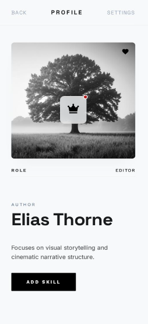

# 📘 Interactive Member Card – Flutter UI Task

A fully interactive and visually layered UI component built using **Flutter**, designed to practice gesture handling, state management, and dynamic UI updates.  
This project focuses on implementing **icon overlays**, **notification badges**, **tap & long‑press gestures**, and **dynamic content rendering**.

---

## 🎯 Objective
The goal of this assignment is to build a dynamic Flutter card with:
- Layered UI elements  
- Interactive icons  
- Notification badge behavior  
- Dynamic skill generation  
- Tap & long‑press gesture handling  

---

## 🚀 Features

### 1️⃣ Heart Like Toggle
- Heart icon placed at the top corner of the card.
- On tap:
  - Switches from **grey** to **red**.
  - Indicates the user has “liked” the card.

---

### 2️⃣ Rank Icon & Notification Badge
- A Rank Icon (Star or Crown) displayed at the center of the card.
- A small **red badge** is overlaid on its corner to indicate unread notifications.

#### 🔹 Clear Notification
On tapping the Rank Icon:
- The red badge disappears.
- The crown icon changes to a different version to show the notification has been read.

---

### 3️⃣ Dynamic Skills (Add Skill Button)
A button labeled **Add Skill** that adds a new skill on every tap.

Each tap displays a new skill such as:
- Flutter  
- Dart  
- Firebase  
- UI/UX  
- And more…

Skills appear at the bottom of the card in a growing list.

---

### 4️⃣ Long Press Gesture (Advanced Interaction)
The **Add Skill** button supports long‑press interaction.

#### 🔵 Long Press Action
When long‑pressed:
- The button color changes to **blue**.
- The button text updates to:  
  **Added Successfully**

This provides an advanced gesture experience inside the UI.

---

## 🎨 UI & Layout
The card design includes:
- A full background image  
- Overlaid icons  
- Notification badge  
- Dynamic text list  
- Clean and modern Flutter styling  

The layout must match the reference design provided in the task description.

---

## 📱 Home Screen Preview
Below is a preview of the Home Screen showcasing the Interactive Member Card:

---

## 📱 Preview (Conceptual)
Below is a conceptual preview of how the UI elements are layered:

- Background Image  
- Heart Icon (top corner)  
- Rank Icon (center)  
- Red Badge (over Rank Icon)  
- Add Skill Button  
- Dynamic Skills List  

---

## 👤 Author
**Nady Al‑Wazzeh**  
Flutter Developer – Interactive UI Training Task
